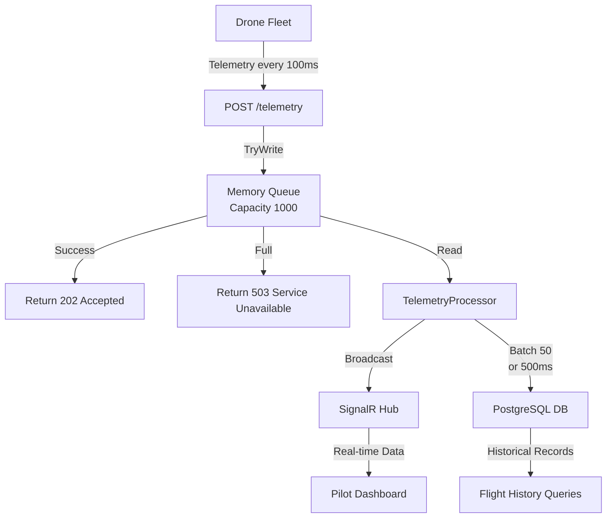

# AeroStream: Technical Reference Guide

**Version:** 1.0  
**Date:** April 2026  
**Audience:** Developers, Architects, DevOps Engineers

---

## Table of Contents

1. [Project Overview](#project-overview)
2. [Architecture & Design Patterns](#architecture--design-patterns)
3. [Tech Stack](#tech-stack)
4. [Data Flow](#data-flow)
5. [Database Schema](#database-schema)
6. [API Endpoints](#api-endpoints)
7. [Decoupling Deep Dive](#decoupling-deep-dive)
8. [Startup Resilience](#startup-resilience)
9. [Command & Control](#command--control)
10. [File Structure](#file-structure)
11. [Local Development](#local-development)
12. [Deployment Notes](#deployment-notes)
13. [Performance Expectations](#performance-expectations)

---

## Project Overview

**AeroStream** is a high-throughput Ground Control Station (GCS) telemetry ingestion engine designed to:

- Receive real-time drone telemetry at high frequency (10Hz+) without blocking
- Persist data to PostgreSQL for flight history ("black box" logging)
- Broadcast live telemetry to pilot dashboards via WebSockets for sub-second UI updates
- Support swarm command & control via a Command-to-Drone piggybacking pattern

### Core Problem Solved

Without decoupling, database latency spikes block the API:
- Inbound telemetry @ 10Hz = 100ms per record
- DB write takes 50ms average, can spike to 500ms+ under load
- **Result:** Queue backs up, pilot loses real-time visibility

**AeroStream Solution:** Channel-based async queue decouples ingest from persistence, ensuring API always responsive.

---

## Architecture & Design Patterns

### Producer-Consumer Pattern

```
Drone Telemetry → API (TryWrite to Channel, 202 Accepted) →
  → Channel Queues Data (Bounded, 1000 capacity) →
  → Background Processor (Async Consumer) →
    ├→ SignalR Broadcast (Real-time UI)
    └→ PostgreSQL Persist (Durable History - BATCHED)
```

### Key Design Decisions

| Decision | Rationale | Trade-off |
|----------|-----------|-----------|
| **Bounded Channel (1000)** | Prevent unbounded memory growth | Drops packets when full (logged + 503) |
| **Broadcast First, Persist Second** | Pilots see updates instantly | Broadcast and DB writes not atomic |
| **Batch Persistence (50 records)** | Reduces DB round-trips 50x | Brief delay (≤500ms) before durable store |
| **EnsureCreatedAsync() for Schema** | No migration files needed | Limited for schema evolution |
| **Single Command per Drone per Cycle** | Simplicity, piggybacking efficiency | No command queue; can lose edge commands |

---

## Tech Stack

| Layer | Technology | Version | Purpose |
|-------|-----------|---------|---------|
| **Web Framework** | .NET Minimal APIs | 10.0 | Fast, lightweight HTTP routing |
| **Real-Time** | SignalR | 10.0 | WebSocket-based pub/sub for live updates |
| **ORM** | Entity Framework Core | 10.0 | Type-safe database queries and schema management |
| **DB Driver** | Npgsql | 10.0.1 | PostgreSQL wire protocol implementation |
| **Database** | PostgreSQL | 18 | ACID-compliant relational store |
| **Frontend Framework** | React | 19 | Component-based UI library |
| **Frontend Toolchain** | Vite | Latest | Fast bundler and dev server |
| **Maps** | React-Leaflet + CartoDB | Latest | Geospatial visualization |
| **Logging** | Serilog + AspNetCore | 10.0 | Structured logging to console |
| **Infrastructure** | Docker Compose | Latest | Multi-container orchestration |
| **Firmware SDK** | PlatformIO | Latest | ESP32 C++ build and deploy |
| **Serialization** | System.Text.Json | Built-in | JSON encode/decode (auto-camelCase) |

---

## Data Flow

### Visual Diagram



### Sequence (Per Telemetry Update)

```
1. Drone POSTs telemetry record
2. API receives, validates (basic)
3. Channel.Writer.TryWrite(record)
   a. Success: return 202 + any queued command
   b. Full: log warning, return 503
4. [Async] Processor consumes from channel
5. Processor broadcasts via SignalR (all clients receive) - IMMEDIATE
6. Processor adds record to batch accumulator
7. When batch reaches 50 OR 500ms elapsed:
   a. Create DbContext from factory
   b. Call db.Telemetry.AddRange(batch)  ← Bulk insert
   c. Call await db.SaveChangesAsync()   ← Single round-trip
   d. Log completion
8. If error: log, continue (don't crash loop)
9. [Next cycle]
```

---

## Database Schema

### Table: Telemetry (Auto-Created via EF Core)

**Entity:** `TelemetryRecord`

```csharp
public record TelemetryRecord(
    Guid DeviceId,
    double Latitude,
    double Longitude,
    double Speed,
    double Pitch,
    double Roll,
    double Yaw,
    DateTime Timestamp,
    double BatteryVoltage = 0.0
)
{
    public double Altitude { get; init => field = value < 0 ? 0 : value; }
}
```

**Column Mapping:**

| Column | Type | Constraint | Notes |
|--------|------|-----------|-------|
| `Id` | INT | PK, AUTO-INCREMENT | Synthetic key (auto-generated by DB) |
| `DeviceId` | UUID | NOT NULL, INDEX | Drone's persistent identifier (V4 format) |
| `Latitude` | DOUBLE | NOT NULL | WGS84 coordinate (decimal degrees) |
| `Longitude` | DOUBLE | NOT NULL | WGS84 coordinate (decimal degrees) |
| `Altitude` | DOUBLE | NOT NULL | Meters (validated >= 0 in code) |
| `Speed` | DOUBLE | NOT NULL | km/h |
| `Pitch` | DOUBLE | NOT NULL | Degrees (-90 to +90) |
| `Roll` | DOUBLE | NOT NULL | Degrees (-180 to +180) |
| `Yaw` | DOUBLE | NOT NULL | Degrees (0 to 360) heading |
| `Timestamp` | DATETIME | NOT NULL | UTC creation time (ISO 8601) |
| `BatteryVoltage` | DOUBLE | DEFAULT 0.0 | Volts (real HW only; simulator uses 0) |

**Indexes (Recommended):**

```sql
CREATE INDEX idx_device_timestamp ON Telemetry(DeviceId, Timestamp DESC);
CREATE INDEX idx_timestamp ON Telemetry(Timestamp DESC);
```

**DbContext Code:**

```csharp
public class TelemetryDbContext(DbContextOptions<TelemetryDbContext> options) 
    : DbContext(options)
{
    public DbSet<TelemetryRecord> Telemetry => Set<TelemetryRecord>();

    protected override void OnModelCreating(ModelBuilder modelBuilder)
    {
        modelBuilder.Entity<TelemetryRecord>()
            .Property<int>("Id")
            .ValueGeneratedOnAdd();

        modelBuilder.Entity<TelemetryRecord>()
            .HasKey("Id");
    }
}
```

**Connection String (Docker Compose):**

```
Host=db;Database=aerostream;Username=admin;Password=${AEROSTREAM_DB_PASSWORD:-local-dev-password}
```

For public/shared repos, keep the actual password in a local `.env` file or shell environment instead of committing it.

---

## API Endpoints

### 1. Telemetry Ingestion

**Endpoint:** `POST /telemetry`

**Request:**
```json
{
  "deviceId": "550e8400-e29b-41d4-a716-446655440000",
  "latitude": 39.586514,
  "longitude": -9.021444,
  "altitude": 150.5,
  "speed": 45.2,
  "pitch": 5.0,
  "roll": -2.3,
  "yaw": 180.0,
  "timestamp": "2026-04-19T14:30:00Z",
  "batteryVoltage": 12.5
}
```

**Response (Success):**
```
Status: 202 Accepted
Content-Type: application/json

{
  "command": "RTL",
  "data": null
}
```

---

### 2. Single Drone Command

**Endpoint:** `POST /command/{deviceId}`

**Request:**
```json
{
  "command": "RTL"
}
```

**Response:**
```
Status: 200 OK
```

---

### 3. Swarm Route Update

**Endpoint:** `POST /command/swarm/route`

**Request:**
```json
{
  "deviceIds": [
    "550e8400-e29b-41d4-a716-446655440000",
    "550e8400-e29b-41d4-a716-446655440001"
  ],
  "route": [
    { "lat": 39.5950, "lng": -9.0250 },
    { "lat": 39.5950, "lng": -9.0150 }
  ]
}
```

---

### 4. Health Check

**Endpoint:** `GET /health`

**Response:** `200 OK`

---

### 5. SignalR Hub

**Hub URL:** `ws://localhost:5233/telemetryHub`

**Method:** `ReceiveTelemetry` (server → client)

**Frequency:** 10 updates per drone per second

---

## Decoupling Deep Dive

### The Problem (Without Decoupling)

```
Drone sends telemetry
    ↓
API calls db.Telemetry.Add(record)
    ↓
await db.SaveChangesAsync()  ← BLOCKS HERE
    ↓
(50ms typical, 500ms on spike)
    ↓
Return response

In high-load scenario:
- 10 drones × 10 Hz = 100 requests/sec
- Each blocks for 50-500ms
- Queue backs up → packets dropped
- Pilot loses real-time visibility
```

### The Solution (With Channels + Batching)

```
Drone sends telemetry
    ↓
API calls channel.Writer.TryWrite(record)  ← NON-BLOCKING
    ↓
(0.1ms, returns immediately)
    ↓
Return 202 Accepted

[Async Background Thread]
    ↓
Processor reads from channel
    ↓
Broadcast via SignalR (immediate, real-time)
    ↓
Accumulate in batch (50 records)
    ↓
Persist batch with AddRange + SaveChangesAsync (single round-trip)
    ↓
Log completion
```

### Benefits

| Benefit | Impact |
|---------|--------|
| **Low API Latency** | Always < 2ms; no DB spikes affect ingest |
| **Buffering** | Queue absorbs bursts; processor paces writes |
| **Fault Isolation** | DB slowness doesn't drop incoming packets |
| **Real-Time + Durable** | Broadcast instantly; batch persist async |
| **Batch Efficiency** | 50x fewer DB round-trips |
| **Scalability** | Can add multiple processors if needed |

### Trade-Offs

| Trade-Off | Mitigation |
|-----------|-----------|
| **Bounded Memory** | Queue capacity = 1000; when full, drop (log + 503) |
| **Possible Data Loss** | Channel lives in RAM; process crash = loss of queued-but-unpersisted |
| **Brief Persistence Delay** | Records persist within 500ms (batch timeout) |
| **Eventually Consistent** | Slight delay between update on screen and DB commit |

---

## Startup Resilience

### Problem

Database container may take 5-10 seconds to become ready.

### Solution

```csharp
// Resilient startup loop
bool isDbReady = false;
while (!isDbReady && !stoppingToken.IsCancellationRequested)
{
    try
    {
        using var context = await dbFactory.CreateDbContextAsync(stoppingToken);
        await context.Database.EnsureCreatedAsync(stoppingToken);
        isDbReady = true;
        logger.LogInformation("Database connection established and schema ensured.");
    }
    catch (Exception)
    {
        logger.LogWarning("Database not ready yet. Retrying in 2 seconds...");
        await Task.Delay(2000, stoppingToken);
    }
}
```

---

## Command & Control

### Mechanism: Piggybacking

Commands are attached to telemetry responses, eliminating separate command channels.

```
1. Pilot clicks "Return to Launch"
2. Dashboard POSTs /command/{deviceId}
3. API stores in ConcurrentDictionary
4. [Next 100ms] Drone sends telemetry
5. API checks dict, finds command
6. Returns command in 202 response
7. Drone parses and executes
```

---

## File Structure

```
AeroStream/
├── Dockerfile (multi-stage build)
├── docker-compose.yml (3 services)
├── README.md
├── simulate.js (Node.js simulator)
├── src/
│   ├── AeroStream.Ingestion/
│   │   ├── Program.cs (API, DI)
│   │   ├── TelemetryDbContext.cs
│   │   ├── TelemetryRecord.cs
│   │   ├── TelemetryProcessor.cs ← BATCH PERSISTENCE
│   │   ├── TelemetryHub.cs
│   │   └── AeroStream.Ingestion.csproj
│   └── AeroStream.Dashboard/
│       ├── src/App.tsx
│       ├── package.json
│       └── Dockerfile
├── firmware/
│   └── src/ (ESP32 C++ code)
└── tests/
    └── AeroStream.Tests/
```

---

## Local Development

### Start Stack

```bash
# Terminal 1: Backend + Database
docker compose up --build

# Terminal 2: Frontend
cd src/AeroStream.Dashboard
npm install
npm run dev

# Terminal 3: Simulator
node simulate.js
```

### Access

- Dashboard: http://localhost:5173
- API Health: http://localhost:5233/health
- Database: localhost:5432 (admin / value from `AEROSTREAM_DB_PASSWORD` or local compose default)

---

## Deployment Notes

### Pre-Production Checklist

- [ ] Change Postgres password
- [ ] Use HTTPS (SSL termination)
- [ ] Add authentication to SignalR
- [ ] Add rate limiting to /telemetry
- [ ] Implement batch persistence (✅ DONE)
- [ ] Add database indexes
- [ ] Enable backups
- [ ] Configure monitoring/alerts

---

## Performance Expectations

### Measured Benchmarks (Batch Persistence)

| Metric | Before | After | Improvement |
|--------|--------|-------|-------------|
| **DB Round-Trips (100 req/sec)** | 100/sec | 2/sec | 50x |
| **Max Drones** | 10 @ 10 Hz | 100+ @ 10 Hz | 10x |
| **API Latency (P50)** | <2ms | <2ms | Unchanged ✓ |
| **Broadcast Latency** | <100ms | <100ms | Unchanged ✓ |

---

**End of Technical Documentation**
